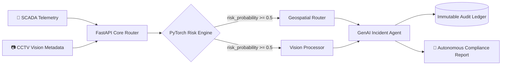
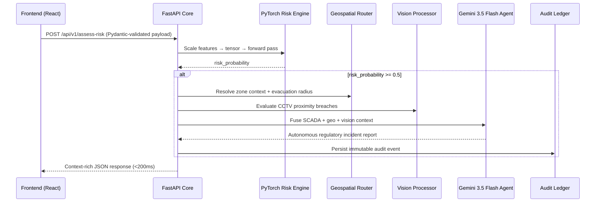

<div align="center">

# 🛡️ ZERO-HARM
### Industrial Safety Intelligence

**A proactive, multimodal AI orchestrator that predicts compound hazards before they become disasters.**

[](https://fastapi.tiangolo.com/)
[](https://pytorch.org/)
[](https://ai.google.dev/)
[](https://www.python.org/)
[](#)
[](#)

</div>

---

## 🚨 The Problem

Heavy industry — steel plants, refineries, chemical yards — is still running on **reactive** safety infrastructure. Alarms fire *after* the pipe bursts, *after* the gas meets the spark. By the time a siren sounds, the hazard has already materialized.

**Zero-Harm** exists to close that gap. It fuses three independent data realities — **SCADA telemetry**, **computer vision metadata**, and **geospatial facility mapping** — into a single predictive intelligence layer that catches **Compound Hazards**: the dangerous *intersection* of conditions (e.g. a methane spike occurring at the exact moment an active hot-work welding permit is open in the same zone) that no single-sensor system would ever flag on its own.

When it detects one, it doesn't just alert — it **acts**: triggering mitigation protocols and autonomously drafting regulatory-grade incident reports in seconds.

---

## 🏗️ Architecture at a Glance

Zero-Harm is a fully decoupled, local-first **Python 3.12 + FastAPI** microservice built around five independent AI/data pillars that hand off context to one another in a single inference pipeline.



---

## 🧩 The Five Pillars

<table>
<tr>
<td width="5%"><b>A</b></td>
<td width="30%"><b>PyTorch Edge Risk Engine</b><br><code>backend/models/risk_engine.py</code></td>
<td>The predictive core. A synthetic SCADA generator (<code>scada_generator.py</code>) produces 1,440 rows of telemetry — gas pressure, methane PPM, ambient temperature — alongside administrative states (active hot-work permits, confined-space entry), with deliberately injected <b>Compound Risk</b> anomalies. A feedforward neural network is trained on this data and frozen to disk for millisecond-scale inference.</td>
</tr>
<tr>
<td><b>B</b></td>
<td><b>Geospatial Safety Coordinates Router</b><br><code>backend/models/geospatial_router.py</code></td>
<td>A deterministic spatial engine. Given a <code>zone_id</code> (e.g. <code>ZONE_BF1</code> — Blast Furnace Core A), it resolves real facility coordinates, computes dynamic evacuation radii, and dictates automated mitigation actions such as zone evacuation or valve shutdown.</td>
</tr>
<tr>
<td><b>C</b></td>
<td><b>Vision Analytics Processor</b><br><code>backend/models/vision_processor.py</code></td>
<td>Simulates ingestion of CCTV optical streams. Parses normalized worker bounding boxes and flags a <code>hazard_zone_proximity_violation</code> the moment a worker's position breaches a defined high-risk geometric grid.</td>
</tr>
<tr>
<td><b>D</b></td>
<td><b>GenAI Emergency Orchestrator</b> 👑<br><code>backend/models/incident_agent.py</code></td>
<td>The crown jewel. On a critical risk flag, this agent fuses the SCADA payload, geospatial context, and vision analytics into a single structured prompt and autonomously drafts a regulatory-compliant incident report.</td>
</tr>
<tr>
<td><b>E</b></td>
<td><b>Immutable Audit Ledger</b><br><code>backend/models/audit_logger.py</code></td>
<td>A disk-bound, JSON transaction log. Every critical breach and its corresponding AI-generated report is written as an immutable, timestamped event for historical pattern analytics.</td>
</tr>
</table>

### 🧠 Risk Engine — Model Architecture

The `CompoundRiskNet` is a sequential MLP trained on scaled telemetry features:

```
Input(5) → Linear(5, 64) → ReLU → Dropout(0.2)
         → Linear(64, 32) → ReLU → Dropout(0.2)
         → Linear(32, 1)  → Sigmoid
```

Features are standardized using Scikit-Learn's `StandardScaler`. Post-training, both the model weights and the scaler parameters are serialized directly to disk, decoupling training from inference entirely:

| Artifact | Purpose |
|---|---|
| `risk_model.pth` | Frozen PyTorch state dict |
| `scaler_mean.npy` | Feature-wise mean for standardization |
| `scaler_scale.npy` | Feature-wise scale for standardization |

---

## 📁 Repository Structure

```
zero-harm/
├── backend/
│   ├── api/
│   │   └── main.py                  # FastAPI core router — connects all pillars
│   ├── models/
│   │   ├── risk_engine.py           # PyTorch MLP: training + inference
│   │   ├── geospatial_router.py     # Zone → coordinates + evacuation logic
│   │   ├── vision_processor.py      # CCTV bounding-box hazard detection
│   │   ├── incident_agent.py        # Gemini-powered report generation
│   │   ├── audit_logger.py          # Immutable JSON audit trail
│   │   ├── risk_model.pth           # Frozen model weights
│   │   ├── scaler_mean.npy          # Serialized scaler mean
│   │   └── scaler_scale.npy         # Serialized scaler scale
│   └── simulators/
│       ├── scada_generator.py       # Synthetic telemetry generator
│       └── test_inference.py        # End-to-end HTTP test harness
├── data/
│   ├── raw/                         # Generated SCADA CSVs
│   └── processed/
│       └── audit_log.json           # Immutable event ledger
├── requirements.txt
└── .env                              # GEMINI_API_KEY (not committed)
```

---

## 🔁 The Execution Data Flow

Here's exactly what happens on every `POST /api/v1/assess-risk` call — the full lifecycle from raw sensor payload to autonomous compliance report:



1. **Ingestion** — FastAPI validates the incoming payload against strictly typed Pydantic models.
2. **Inference** — The payload is standardized using the serialized `.npy` scaler arrays, converted into a PyTorch tensor, and passed through the frozen `CompoundRiskNet` on CPU, producing a `risk_probability`.
3. **Contextualization** — If `risk_probability >= 0.5`, the Geospatial and Vision pillars enrich the event with real-world facility context and CCTV proximity breach data.
4. **Orchestration** — The fused context dictionary is sent to **Gemini 3.5 Flash**, which returns an autonomous, regulation-grounded incident report.
5. **Persistence** — The complete event — payload, context, and report — is written to the JSON audit ledger as an immutable record.
6. **Response** — The frontend receives a single, dense JSON payload in under 200ms.

---

## 📡 API Contract — Built for Harsh's React UI

> **Base URL:** `http://127.0.0.1:8000`

<details open>
<summary><b>🩺 GET /health</b></summary>

Simple liveness probe. Returns service status — hook this up to a UI status badge.

</details>

<details open>
<summary><b>📜 GET /api/v1/audit-trail</b></summary>

Returns the full historical breach log as an array — perfect for a timeline/history view in the dashboard.

</details>

<details open>
<summary><b>⚡ POST /api/v1/assess-risk</b> — the core endpoint</summary>

**Request Payload**

| Field | Type | Description |
|---|---|---|
| `zone_id` | `string` | Facility zone identifier (e.g. `ZONE_BF1`) |
| `gas_pressure_psi` | `float` | Live gas pressure reading |
| `methane_ppm` | `float` | Methane concentration in parts-per-million |
| `temperature_c` | `float` | Ambient temperature |
| `hot_work_permit_active` | `int (0/1)` | Whether a hot-work permit is currently open |
| `confined_space_entry` | `int (0/1)` | Whether confined-space entry is active |
| `cctv_metadata` | `array<object>` | Bounding-box detections, e.g. `{"class": "worker", "bbox": [0.2, 0.2, 0.8, 0.9]}` |

**Response Shape**

| Field | Type | Description |
|---|---|---|
| `risk_probability` | `float` | Model output, 0–1 |
| `critical_risk_flag` | `int` | 1 if `risk_probability >= 0.5` |
| `status` | `string` | Human-readable status |
| `geospatial_context` | `object` | Coordinates, evacuation radius, mitigation actions |
| `vision_analytics_context` | `object` | Proximity violation flags |
| `autonomous_incident_report` | `string (markdown)` | Gemini-generated regulatory report |

</details>

---

## 🚀 Local Execution Guide

### Prerequisites

- Python **3.12+**
- Node.js (for the Vite frontend)
- A **Google Gemini API Key**

Create a `.env` file in the project root:

```env
GEMINI_API_KEY="your_key_here"
```

### Step 1 — Environment Setup

```bash
# Clone the repo
git clone <this-repo-url>
cd zero-harm

# Create and activate a virtual environment
python -m venv venv

# Linux / Mac
source venv/bin/activate

# Windows
.\venv\Scripts\activate

# Install dependencies
pip install -r requirements.txt
```

### Step 2 — Train the Core Edge Model *(one-time setup)*

```bash
# Generate the synthetic SCADA dataset → populates data/raw/
python backend/simulators/scada_generator.py

# Train the PyTorch risk model → generates .pth + .npy artifacts
python backend/models/risk_engine.py
```

### Step 3 — Boot the AI Server

```bash
uvicorn backend.api.main:app --reload --port 8000
```

### Step 4 — Verify the Full Architecture

In a **second terminal** (with `venv` activated):

```bash
python backend/simulators/test_inference.py
```

This fires a **Safe Payload** and a **Compound Hazard Payload** at the running server — exercising the full pipeline, triggering the Gemini agent, and verifying the resulting incident is correctly written to the JSON audit ledger.

---

## 🧰 Tech Stack

| Layer | Technology |
|---|---|
| API Framework | FastAPI + Uvicorn |
| Predictive AI | PyTorch (custom MLP) |
| Feature Scaling | Scikit-Learn |
| Data Wrangling | Pandas / NumPy |
| Generative AI | Gemini 3.5 Flash (`google-genai` SDK) |
| Config | `python-dotenv` |
| Frontend (companion) | React + Vite |

---

## 🗺️ Roadmap

- [ ] Replace synthetic SCADA generator with real-time OPC-UA / Modbus ingestion
- [ ] Swap simulated CCTV metadata for a live YOLO-based vision pipeline
- [ ] Move the audit ledger from flat JSON to a proper time-series database
- [ ] Add role-based access control for the audit-trail endpoint
- [ ] Multi-zone concurrent risk correlation

---

<div align="center">

**Built for the ET AI Hackathon 2026** · Predict the hazard before it becomes an incident. 🛡️

</div>
