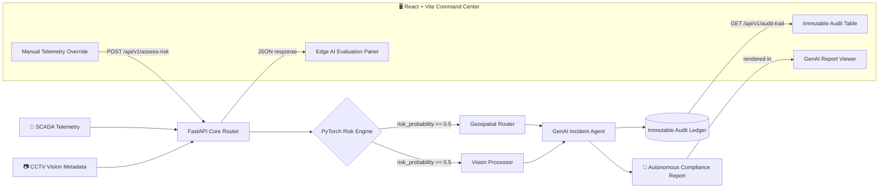
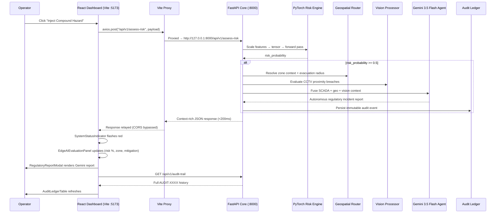

<div align="center">

# 🛡️ ZERO-HARM
### Industrial Safety Intelligence

**A proactive, multimodal AI orchestrator that predicts compound hazards before they become disasters.**

[](https://fastapi.tiangolo.com/)
[](https://pytorch.org/)
[](https://ai.google.dev/)
[](https://react.dev/)
[](https://vitejs.dev/)
[](https://tailwindcss.com/)
[](https://www.python.org/)
[](#)
[](#)

</div>

---

## 🚨 The Problem

Heavy industry — steel plants, refineries, chemical yards — is still running on **reactive** safety infrastructure. Alarms fire *after* the pipe bursts, *after* the gas meets the spark. By the time a siren sounds, the hazard has already materialized.

**Zero-Harm** exists to close that gap. It fuses three independent data realities — **SCADA telemetry**, **computer vision metadata**, and **geospatial facility mapping** — into a single predictive intelligence layer that catches **Compound Hazards**: the dangerous *intersection* of conditions (e.g. a methane spike occurring at the exact moment an active hot-work welding permit is open in the same zone) that no single-sensor system would ever flag on its own.

When it detects one, it doesn't just alert — it **acts**: triggering mitigation protocols and autonomously drafting regulatory-grade incident reports in seconds — all surfaced live on a dark-mode industrial command center so a control-room operator sees the full compound-risk picture the instant it forms.

---

## 🏗️ Architecture at a Glance

Zero-Harm is a fully decoupled, local-first system: a **Python 3.12 + FastAPI** microservice housing five independent AI/data pillars, fronted by a **React + Vite** command-center dashboard that consumes the pipeline in real time.



---

## 🧩 The Six Pillars

<table>
<tr>
<td width="5%"><b>A</b></td>
<td width="30%"><b>PyTorch Edge Risk Engine</b><br><code>backend/models/risk_engine.py</code></td>
<td>The predictive core. A synthetic SCADA generator (<code>scada_generator.py</code>) produces 1,440 rows of telemetry — gas pressure, methane PPM, ambient temperature — alongside administrative states (active hot-work permits, confined-space entry), with deliberately injected <b>Compound Risk</b> anomalies. A feedforward neural network is trained on this data and frozen to disk for millisecond-scale inference.</td>
</tr>
<tr>
<td><b>B</b></td>
<td><b>Geospatial Safety Coordinates Router</b><br><code>backend/models/geospatial_router.py</code></td>
<td>A deterministic spatial engine. Given a <code>zone_id</code> (e.g. <code>ZONE_BF1</code> — Blast Furnace Core A), it resolves real facility coordinates, computes dynamic evacuation radii, and dictates automated mitigation actions such as zone evacuation or valve shutdown.</td>
</tr>
<tr>
<td><b>C</b></td>
<td><b>Vision Analytics Processor</b><br><code>backend/models/vision_processor.py</code></td>
<td>Simulates ingestion of CCTV optical streams. Parses normalized worker bounding boxes and flags a <code>hazard_zone_proximity_violation</code> the moment a worker's position breaches a defined high-risk geometric grid.</td>
</tr>
<tr>
<td><b>D</b></td>
<td><b>GenAI Emergency Orchestrator</b> 👑<br><code>backend/models/incident_agent.py</code></td>
<td>The crown jewel. On a critical risk flag, this agent fuses the SCADA payload, geospatial context, and vision analytics into a single structured prompt and autonomously drafts a regulatory-compliant incident report.</td>
</tr>
<tr>
<td><b>E</b></td>
<td><b>Immutable Audit Ledger</b><br><code>backend/models/audit_logger.py</code></td>
<td>A disk-bound, JSON transaction log. Every critical breach and its corresponding AI-generated report is written as an immutable, timestamped event for historical pattern analytics.</td>
</tr>
<tr>
<td><b>F</b></td>
<td><b>React Command Center</b> 🆕<br><code>frontend/src/</code></td>
<td>The human-facing layer. A dark-mode (<code>bg-slate-900</code>) industrial dashboard that lets an operator inject synthetic payloads on demand, watch the PyTorch model reason in real time, read the Gemini-generated compliance report in a frosted-glass modal, and audit the full historical breach ledger — all without leaving a single screen.</td>
</tr>
</table>

### 🧠 Risk Engine — Model Architecture

The `CompoundRiskNet` is a sequential MLP trained on scaled telemetry features:

```
Input(5) → Linear(5, 64) → ReLU → Dropout(0.2)
        → Linear(64, 32) → ReLU → Dropout(0.2)
        → Linear(32, 1)  → Sigmoid
```

Features are standardized using Scikit-Learn's `StandardScaler`. Post-training, both the model weights and the scaler parameters are serialized directly to disk, decoupling training from inference entirely:

| Artifact | Purpose |
|---|---|
| `risk_model.pth` | Frozen PyTorch state dict |
| `scaler_mean.npy` | Feature-wise mean for standardization |
| `scaler_scale.npy` | Feature-wise scale for standardization |

---

## 🖥️ The Command Center — UI/UX

The frontend is built as a **dark-mode industrial command center**, not a generic admin panel — every visual decision is optimized for split-second legibility under control-room conditions.

- **Base theme:** `bg-slate-900` canvas throughout, with high-contrast typography and status-driven accent colors so risk states are readable at a glance, not buried in a legend.
- **Real-Time System Status Indicator:** A persistent status pill that idles in a calm state and **flashes red** the instant `critical_risk_flag = 1` comes back from the API — an unmissable, glanceable signal for anomaly detection.
- **Iconography:** `lucide-react` powers every icon in the dashboard — gauges, flame/gas glyphs, camera icons for CCTV panels, and shield icons for the audit ledger — keeping the visual language consistently "industrial."

### 🎛️ Key Dashboard Components

<table>
<tr>
<td width="5%">1️⃣</td>
<td width="30%"><b>Manual Telemetry Override</b></td>
<td>A pair of one-click injector buttons — <b>"Inject Safe Payload"</b> and <b>"Inject Compound Hazard"</b> — that fire pre-built payloads directly at the PyTorch edge model via <code>POST /api/v1/assess-risk</code>, letting judges and operators demo the full compound-risk detection loop on demand without touching a terminal.</td>
</tr>
<tr>
<td>2️⃣</td>
<td><b>Edge AI Evaluation Panel</b></td>
<td>The live nerve center of the dashboard. Renders the real-time PyTorch <code>risk_probability</code> (via <code>recharts</code> gauges/sparklines), the targeted <code>zone_id</code>, CCTV vision anomaly status from the Vision Processor, and the automated mitigation protocols dictated by the Geospatial Router — all updating the instant a new assessment resolves.</td>
</tr>
<tr>
<td>3️⃣</td>
<td><b>GenAI Regulatory Report Viewer</b></td>
<td>A dedicated <b>frosted-glass modal</b> (backdrop-blur over the darkened dashboard) that surfaces the Factories Act / OISD-compliant incident report the moment Gemini 3.5 Flash finishes drafting it — giving operators a court-ready document without ever leaving the live view.</td>
</tr>
<tr>
<td>4️⃣</td>
<td><b>Immutable Audit Ledger</b></td>
<td>A live-updating data table anchoring the bottom of the dashboard, fetched from <code>GET /api/v1/audit-trail</code>, tracking the full history of <code>AUDIT-XXXX</code> events — every compound breach, its timestamp, and its generated report, in one scrollable, tamper-evident timeline.</td>
</tr>
</table>

---

## 📁 Repository Structure

```
zero-harm/
├── backend/
│   ├── api/
│   │   └── main.py                  # FastAPI core router — connects all pillars
│   ├── models/
│   │   ├── risk_engine.py           # PyTorch MLP: training + inference
│   │   ├── geospatial_router.py     # Zone → coordinates + evacuation logic
│   │   ├── vision_processor.py      # CCTV bounding-box hazard detection
│   │   ├── incident_agent.py        # Gemini-powered report generation
│   │   ├── audit_logger.py          # Immutable JSON audit trail
│   │   ├── risk_model.pth           # Frozen model weights
│   │   ├── scaler_mean.npy          # Serialized scaler mean
│   │   └── scaler_scale.npy         # Serialized scaler scale
│   └── simulators/
│       ├── scada_generator.py       # Synthetic telemetry generator
│       └── test_inference.py        # End-to-end HTTP test harness
├── frontend/
│   ├── src/
│   │   ├── components/
│   │   │   ├── ManualOverridePanel.jsx     # Safe / Compound Hazard injector buttons
│   │   │   ├── EdgeAIEvaluationPanel.jsx   # Live risk_probability + zone + mitigation view
│   │   │   ├── RegulatoryReportModal.jsx   # Frosted-glass Gemini report viewer
│   │   │   ├── AuditLedgerTable.jsx        # Live AUDIT-XXXX history table
│   │   │   └── SystemStatusIndicator.jsx   # Flashing critical-state status pill
│   │   ├── lib/
│   │   │   └── api.js                      # Axios instance + endpoint wrappers
│   │   ├── App.jsx
│   │   ├── main.jsx
│   │   └── index.css                       # Tailwind v3 directives
│   ├── vite.config.js                      # /api proxy → http://127.0.0.1:8000
│   ├── tailwind.config.js
│   ├── postcss.config.js
│   ├── package.json                        # vite@^5, tailwindcss@^3
│   └── index.html
├── data/
│   ├── raw/                         # Generated SCADA CSVs
│   └── processed/
│       └── audit_log.json           # Immutable event ledger
├── requirements.txt
└── .env                              # GEMINI_API_KEY (not committed)
```

---

## 🔁 The Execution Data Flow

Here's exactly what happens on every dashboard-triggered assessment — the full lifecycle from a button click in the command center to a rendered compliance report:



1. **Ingestion** — FastAPI validates the incoming payload against strictly typed Pydantic models.
2. **Inference** — The payload is standardized using the serialized `.npy` scaler arrays, converted into a PyTorch tensor, and passed through the frozen `CompoundRiskNet` on CPU, producing a `risk_probability`.
3. **Contextualization** — If `risk_probability >= 0.5`, the Geospatial and Vision pillars enrich the event with real-world facility context and CCTV proximity breach data.
4. **Orchestration** — The fused context dictionary is sent to **Gemini 3.5 Flash**, which returns an autonomous, regulation-grounded incident report.
5. **Persistence** — The complete event — payload, context, and report — is written to the JSON audit ledger as an immutable record.
6. **Response** — The frontend receives a single, dense JSON payload in under 200ms, the status indicator flashes red, the Edge AI Evaluation Panel updates live, and the frosted-glass modal surfaces the compliance report — all without a page reload.

---

## 📡 API Contract — Consumed by the React Command Center

> **Base URL (proxied):** `/api` → `http://127.0.0.1:8000`

All frontend requests are issued through a single `axios` instance (`frontend/src/lib/api.js`), routed through the Vite dev-server proxy defined in `vite.config.js` — this means the dashboard never talks to `127.0.0.1:8000` directly, sidestepping CORS entirely during local development.

<details open>
<summary><b>🩺 GET /health</b></summary>

Simple liveness probe. Wired directly to the `SystemStatusIndicator` component's idle/online state.

</details>

<details open>
<summary><b>📜 GET /api/v1/audit-trail</b></summary>

Returns the full historical breach log as an array — powers the `AuditLedgerTable` component's live-updating history view.

</details>

<details open>
<summary><b>⚡ POST /api/v1/assess-risk</b> — the core endpoint</summary>

Called by the `ManualOverridePanel`'s injector buttons and by any live SCADA feed. Drives the `EdgeAIEvaluationPanel` and `RegulatoryReportModal` in real time.

**Request Payload**

| Field | Type | Description |
|---|---|---|
| `zone_id` | `string` | Facility zone identifier (e.g. `ZONE_BF1`) |
| `gas_pressure_psi` | `float` | Live gas pressure reading |
| `methane_ppm` | `float` | Methane concentration in parts-per-million |
| `temperature_c` | `float` | Ambient temperature |
| `hot_work_permit_active` | `int (0/1)` | Whether a hot-work permit is currently open |
| `confined_space_entry` | `int (0/1)` | Whether confined-space entry is active |
| `cctv_metadata` | `array<object>` | Bounding-box detections, e.g. `{"class": "worker", "bbox": [0.2, 0.2, 0.8, 0.9]}` |

**Response Shape**

| Field | Type | Description |
|---|---|---|
| `risk_probability` | `float` | Model output, 0–1 — plotted live via `recharts` |
| `critical_risk_flag` | `int` | 1 if `risk_probability >= 0.5` — triggers the red status flash |
| `status` | `string` | Human-readable status |
| `geospatial_context` | `object` | Coordinates, evacuation radius, mitigation actions |
| `vision_analytics_context` | `object` | Proximity violation flags |
| `autonomous_incident_report` | `string (markdown)` | Gemini-generated regulatory report — rendered inside the frosted-glass modal |

</details>

---

## 🚀 Local Execution Guide

### Prerequisites

- Python **3.12+**
- Node.js **18.x** (required for Vite 5 compatibility)
- A **Google Gemini API Key**

Create a `.env` file in the project root:

```env
GEMINI_API_KEY="your_key_here"
```

### Step 1 — Backend Environment Setup

```bash
# Clone the repo
git clone <this-repo-url>
cd zero-harm

# Create and activate a virtual environment
python -m venv venv

# Linux / Mac
source venv/bin/activate

# Windows
.\venv\Scripts\activate

# Install dependencies
pip install -r requirements.txt
```

### Step 2 — Train the Core Edge Model *(one-time setup)*

```bash
# Generate the synthetic SCADA dataset → populates data/raw/
python backend/simulators/scada_generator.py

# Train the PyTorch risk model → generates .pth + .npy artifacts
python backend/models/risk_engine.py
```

### Step 3 — Boot the AI Server

```bash
uvicorn backend.api.main:app --reload --port 8000
```

### Step 4 — Boot the React Command Center

In a **second terminal**:

```bash
cd frontend
npm install
npm run dev
```

The dashboard boots on **`http://localhost:5173`**.

> **Architecture Note:** `vite.config.js` defines a dev-server proxy that transparently forwards all `/api/*` requests to the FastAPI backend at `http://127.0.0.1:8000`. This means the browser only ever talks to `localhost:5173` — the proxy handles the hop to the backend server-side, **completely bypassing CORS** without needing any `CORSMiddleware` gymnastics in production.

### Step 5 — Verify the Full Architecture

In a **third terminal** (with `venv` activated):

```bash
python backend/simulators/test_inference.py
```

This fires a **Safe Payload** and a **Compound Hazard Payload** at the running server — exercising the full pipeline, triggering the Gemini agent, and verifying the resulting incident is correctly written to the JSON audit ledger. Watch the React dashboard's status indicator and audit table update live as this script runs.

---

## 🧰 Tech Stack

| Layer | Technology |
|---|---|
| API Framework | FastAPI + Uvicorn |
| Predictive AI | PyTorch (custom MLP) |
| Feature Scaling | Scikit-Learn |
| Data Wrangling | Pandas / NumPy |
| Generative AI | Gemini 3.5 Flash (`google-genai` SDK) |
| Config | `python-dotenv` |
| Frontend Framework | React |
| Build Tooling | Vite **v5** (pinned for Node 18 compatibility) |
| Styling | Tailwind CSS **v3** (pinned for stability) |
| API Client | Axios |
| Data Visualization | Recharts (live telemetry graphs) |
| Iconography | Lucide-React (industrial UI icon set) |

---

## 🗺️ Roadmap

- [ ] Replace synthetic SCADA generator with real-time OPC-UA / Modbus ingestion
- [ ] Swap simulated CCTV metadata for a live YOLO-based vision pipeline
- [ ] Move the audit ledger from flat JSON to a proper time-series database
- [ ] Add role-based access control for the audit-trail endpoint
- [ ] Multi-zone concurrent risk correlation
- [ ] WebSocket-based push updates to replace dashboard polling
- [ ] Production CORS hardening for a deployed (non-proxied) frontend build

---

<div align="center">

**Built for the ET AI Hackathon 2026** · Predict the hazard before it becomes an incident. 🛡️

</div>
